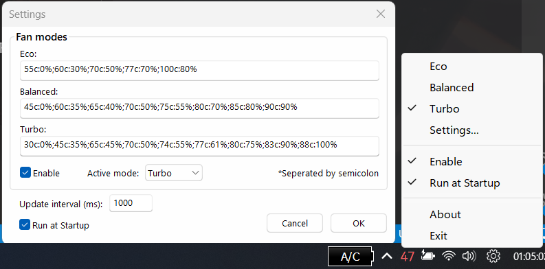

 

  
  <h3 align="center">FanControl++</h3>

  

    Lightweight fan controller for ASUS laptops.
     
     
    
    
    
    
    
  

## [Download](https://github.com/Legend0fHell/FanControlPP/releases/latest/download/FanControl++.zip)

## About the project

My laptop does not support the Fan Profile option, but it often overheats. Looked for apps to control fans, but none is working.
The BIOS also doesn't allow for custom fan profiles.

Tinkering around with Fan Diagnosis tool in [MyASUS](https://apps.microsoft.com/store/detail/myasus/9N7R5S6B0ZZH) application, 
I figured out the library it uses (`AsusWinIO64.dll`) and the functions that library contains.

**This program essentially uses that library to function.**

## Features
- Three fan modes included: Eco, Balanced, Turbo (can be changed/customized freely)
- Can be disabled/enabled at any time (i.e. let the system handle the fan instead of the program)
- Tray icon showing current temperature (and additional details such as current fan speed, CPU temp, GPU temp)
- Option to run the program at system startup
- Lightweight (doesn't install anything, uses less than 3MB of RAM!!)

## Requirements
- Windows 8.1 or higher. x64 is required.
- Administrator rights needed for the program to work as intended.
- [Visual C++ 2022 Redistributable package](https://learn.microsoft.com/en-us/cpp/windows/latest-supported-vc-redist?view=msvc-170)
- Fan Diagnosis tool in MyASUS application is working normally (as this program uses the same library).

## Disclaimer
FanControl++ is not a driver. FanControl++ is free, and licensed under [GNU General Public License 3](https://github.com/Legend0fHell/FanControlPP/blob/master/LICENSE).

Included `AsusWinIO64.dll` is licensed by (c) ASUSTek COMPUTER INC. which can also be found in `C:\Windows\System32\DriverStore\FileRepository\asussci2.inf_amd64_-\ASUSSystemAnalysis\` if you have MyASUS installed.

I make no claims to any assets belonging to ASUSTek COMPUTER INC. and use them purely for informational purposes only, in compliance with their EULA.

THE SOFTWARE IS PROVIDED “AS IS” AND WITHOUT WARRANTY OF ANY KIND, EXPRESS OR IMPLIED, INCLUDING BUT NOT LIMITED TO THE WARRANTIES OF MERCHANTABILITY, FITNESS FOR A PARTICULAR PURPOSE AND NONINFRINGEMENT. MISUSE OF THIS SOFTWARE COULD CAUSE SYSTEM INSTABILITY OR MALFUNCTION.

(c) 2024 Phạm Nhật Quang (Legend0fHell).
